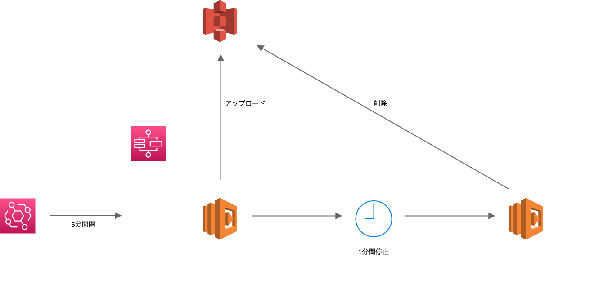

# CFnのサンプル（Step Functions）

## 構成図



## ECRにログイン

```sh
$ aws ecr get-login-password --region ap-northeast-1 | docker login --username AWS --password-stdin <ID>.dkr.ecr.ap-northeast-1.amazonaws.com
```

## ECRにプッシュ

`src/cmd/put` と `src/cmd/delete` でそれぞれ実行

```sh
$ docker build . -t <REPOSITORY_NAME>
$ docker tag <REPOSITORY_NAME>:latest <ID>.dkr.ecr.ap-northeast-1.amazonaws.com/<REPOSITORY_NAME>
$ docker push <ID>.dkr.ecr.ap-northeast-1.amazonaws.com/<REPOSITORY_NAME>:latest
```

## CFnをデプロイ

```sh
$ aws cloudformation create-stack \
    --stack-name <STACK_NAME> \
    --template-body file://template.yaml \
    --parameters ParameterKey=BucketName,ParameterValue=<BUCKET_NAME> \
                 ParameterKey=PutLambdaImageUri,ParameterValue=<PUT_IMAGE_URI>:latest \
                 ParameterKey=DeleteLambdaImageUri,ParameterValue=<DELETE_IMAGE_URI>:latest \
    --capabilities CAPABILITY_NAMED_IAM
```
